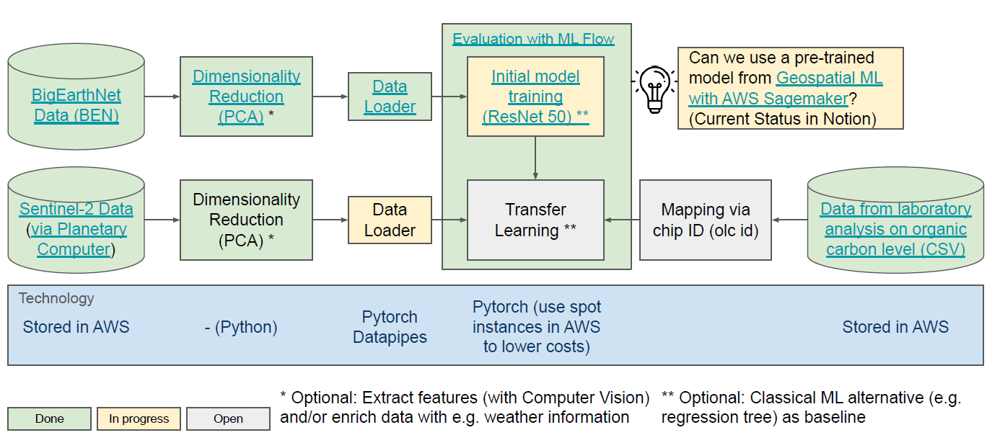

MI4People_soil_quality
==============================

This repo is the work in progress on MI4people's Soil Quality Evaluation System. 

How to run the pipeline?
------------

The pipeline depicted in the graphic below consists of a series of steps that need to be executed and will be outlined in detail. Additionally, it is feasible to execute a subset of these steps while utilizing interim results from preceding steps if they are accessible.

### Prerequisites

**Setup Python environment**:
1. Setup an Python environment using Python 3.X
2. Install required packages via `pip install -r requirements.txt`

**Credentials**:
1. It is necessary copy the file `dummy_aws_credentials.yaml` and rename it to `aws_credentials.yaml`. 
2. Store your personal AWS credentials in that file to get access to the S3 bucket and make use of the AWS resources for model training.
3. Add the credentials of the MYSQL database in that file to log the experiments via MLflow.

### 1. Initial Model Training

#### Data Gathering
These are one-time steps which need to be performed only once to gather the necessary data.
1. The data of the BigEarthNet-v1.0 dataset is downloaded and saved in a AWS S3 bucket.
2. All potential labels of the BigEarthNet-v1.0 dataset are extracted and saved in `data/01_raw/ben_labels.pickle` by executing `notebooks/utils/bigearthnet_label_creation.ipynb`.

#### Model Training

To train the initial model based on the BigEartNet-v1.0 dataset, you need to execute the pipeline stored in `src/models/bigearthnet_training.py`. 

The results of the pipeline run will be logged automatically using MLflow and stored in a MYSQL database on AWS.

### 2. Transfer Learning

Project Organization
------------

    ├── LICENSE
    ├── Makefile           <- Makefile with commands like `make data` or `make train`
    ├── README.md          <- The top-level README for developers using this project.
    ├── data
    │   ├── external       <- Data from third party sources.
    │   ├── interim        <- Intermediate data that has been transformed.
    │   ├── processed      <- The final, canonical data sets for modeling.
    │   └── raw            <- The original, immutable data dump.
    │
    ├── docs               <- A default Sphinx project; see sphinx-doc.org for details
    │
    ├── models             <- Trained and serialized models, model predictions, or model summaries
    │
    ├── notebooks          <- Jupyter notebooks. Naming convention is a number (for ordering),
    │   |                     the creator's initials, and a short `-` delimited description, e.g.
    │   |                     `1.0-jqp-initial-data-exploration`.
    │   ├── exploration    <- Notebooks for (initial) data exploration.
    │   ├── training       <- Notebooks for training and conceptualizing models.
    │   └── prediction     <- Notebooks for prediction and evaluation.
    |
    ├── references         <- Data dictionaries, manuals, and all other explanatory materials.
    │
    ├── reports            <- Generated analysis as HTML, PDF, LaTeX, etc.
    │   └── figures        <- Generated graphics and figures to be used in reporting
    │
    ├── requirements.txt   <- The requirements file for reproducing the analysis environment, e.g.
    │                         generated with `pip freeze > requirements.txt`
    │
    ├── setup.py           <- makes project pip installable (pip install -e .) so src can be imported
    ├── src                <- Source code for use in this project.
    │   ├── __init__.py    <- Makes src a Python module
    │   │
    │   ├── data           <- Scripts to download or generate data
    │   │   └── make_dataset.py
    │   │
    │   ├── features       <- Scripts to turn raw data into features for modeling
    │   │   └── build_features.py
    │   │
    │   ├── models         <- Scripts to train models and then use trained models to make
    │   │   │                 predictions
    │   │   ├── predict_model.py
    │   │   └── train_model.py
    │   │
    │   └── visualization  <- Scripts to create exploratory and results oriented visualizations
    │       └── visualize.py
    │
    └── tox.ini            <- tox file with settings for running tox; see tox.readthedocs.io

--------

<small>Project based on the <a target="_blank" href="https://drivendata.github.io/cookiecutter-data-science/">cookiecutter data science project template</a>. #cookiecutterdatascience</small>

